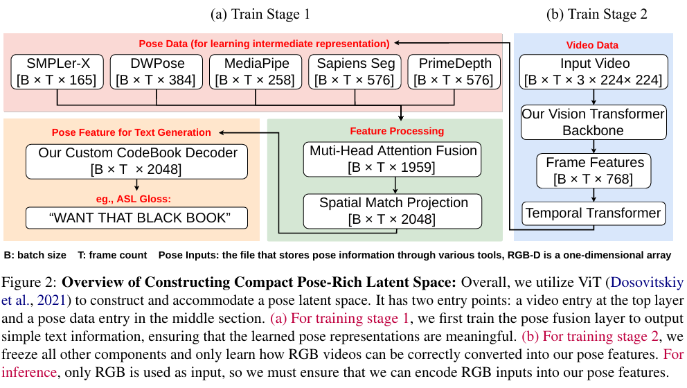
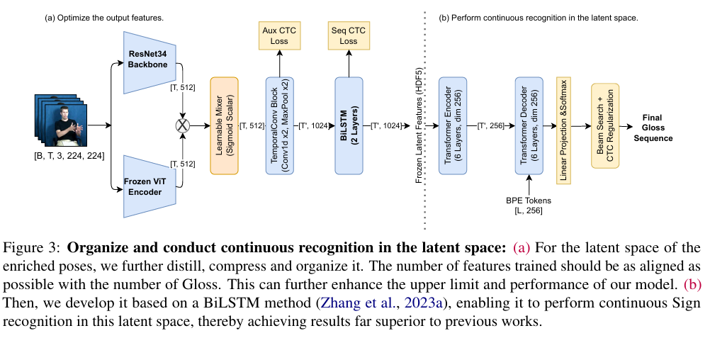
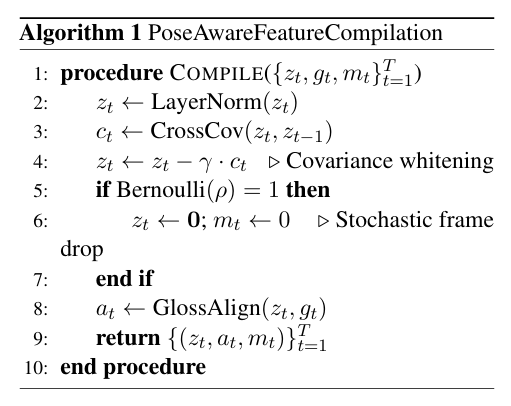
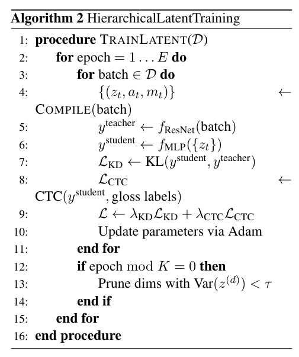
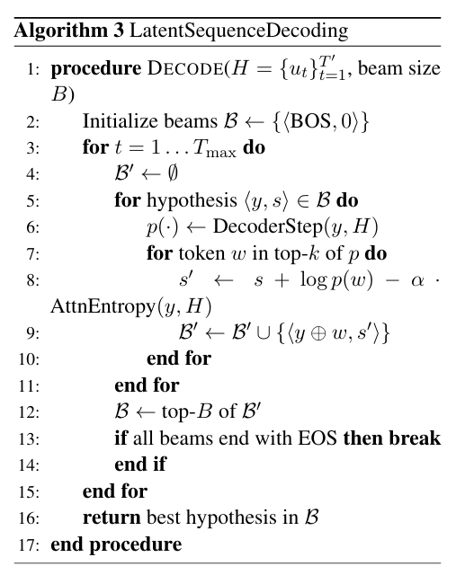
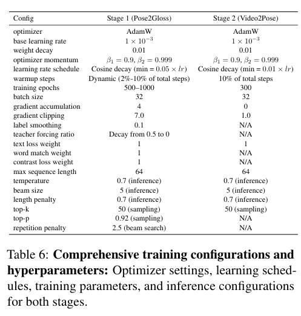

## Method

We summarize the core architecture and training workflow for SignX below.

### Architecture+Training Flow

  <button class="signx-carousel-arrow signx-carousel-left" type="button" aria-label="Scroll left"><i class="fa fa-chevron-left"></i></button>
  

    <figure class="signx-carousel-slide">
      <button class="signx-zoom" type="button" aria-label="Zoom image"><i class="fa fa-search-plus"></i></button>
      
      <figcaption class="signx-carousel-caption">Figure 2. Compact pose-rich latent space overview.</figcaption>
    </figure>
    <figure class="signx-carousel-slide">
      <button class="signx-zoom" type="button" aria-label="Zoom image"><i class="fa fa-search-plus"></i></button>
      
      <figcaption class="signx-carousel-caption">Figure 3. Continuous recognition in the latent space.</figcaption>
    </figure>
  

  <button class="signx-carousel-arrow signx-carousel-right" type="button" aria-label="Scroll right"><i class="fa fa-chevron-right"></i></button>

### Algorithm+Configuration

  <button class="signx-carousel-arrow signx-carousel-left" type="button" aria-label="Scroll left"><i class="fa fa-chevron-left"></i></button>
  

    <figure class="signx-carousel-slide">
      <button class="signx-zoom" type="button" aria-label="Zoom image"><i class="fa fa-search-plus"></i></button>
      
      <figcaption class="signx-carousel-caption">Algorithm 1. Pose-aware feature compilation.</figcaption>
    </figure>
    <figure class="signx-carousel-slide">
      <button class="signx-zoom" type="button" aria-label="Zoom image"><i class="fa fa-search-plus"></i></button>
      
      <figcaption class="signx-carousel-caption">Algorithm 2. Hierarchical latent training.</figcaption>
    </figure>
    <figure class="signx-carousel-slide">
      <button class="signx-zoom" type="button" aria-label="Zoom image"><i class="fa fa-search-plus"></i></button>
      
      <figcaption class="signx-carousel-caption">Algorithm 3. Latent sequence decoding.</figcaption>
    </figure>
    <figure class="signx-carousel-slide">
      <button class="signx-zoom" type="button" aria-label="Zoom image"><i class="fa fa-search-plus"></i></button>
      
      <figcaption class="signx-carousel-caption">Table 6. Training configurations and hyperparameters.</figcaption>
    </figure>
  

  <button class="signx-carousel-arrow signx-carousel-right" type="button" aria-label="Scroll right"><i class="fa fa-chevron-right"></i></button>

  

    <button class="signx-modal-close" type="button" aria-label="Close"><i class="fa fa-times"></i></button>
    
  

