## Results

### SOTA+Cross-Dataset+CSLR/ISLR Evaluation

  <button class="signx-carousel-arrow signx-carousel-left" type="button" aria-label="Scroll left"><i class="fa fa-chevron-left"></i></button>
  

    <figure class="signx-carousel-slide">
      <button class="signx-zoom" type="button" aria-label="Zoom image"><i class="fa fa-search-plus"></i></button>
      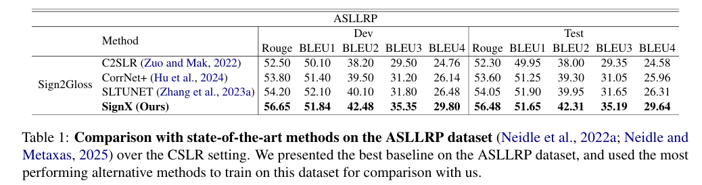
      <figcaption class="signx-carousel-caption">Table 1. ASLLRP comparison.</figcaption>
    </figure>
    <figure class="signx-carousel-slide">
      <button class="signx-zoom" type="button" aria-label="Zoom image"><i class="fa fa-search-plus"></i></button>
      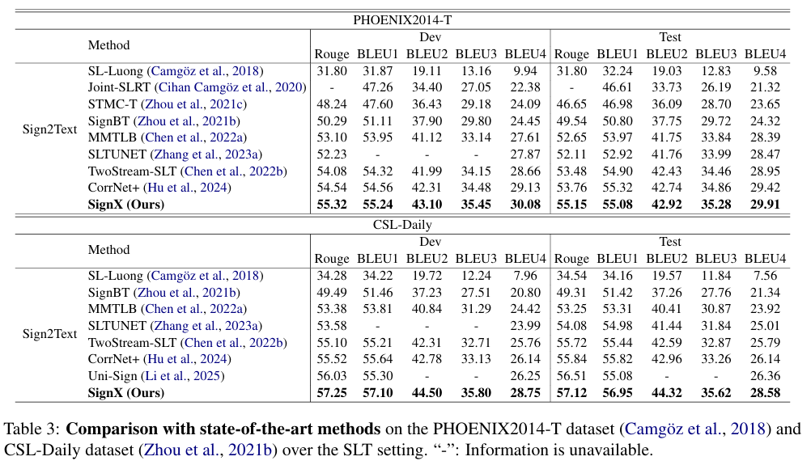
      <figcaption class="signx-carousel-caption">Table 3. PHOENIX2014-T and CSL-Daily comparison.</figcaption>
    </figure>
    <figure class="signx-carousel-slide">
      <button class="signx-zoom" type="button" aria-label="Zoom image"><i class="fa fa-search-plus"></i></button>
      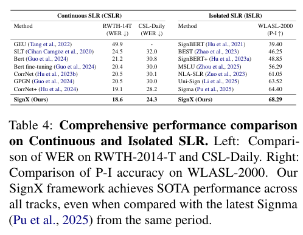
      <figcaption class="signx-carousel-caption">Table 4. Continuous and isolated SLR comparison.</figcaption>
    </figure>
  

  <button class="signx-carousel-arrow signx-carousel-right" type="button" aria-label="Scroll right"><i class="fa fa-chevron-right"></i></button>

### Qualitative+Cross-Language Evaluation

  <button class="signx-carousel-arrow signx-carousel-left" type="button" aria-label="Scroll left"><i class="fa fa-chevron-left"></i></button>
  

    <figure class="signx-carousel-slide">
      <button class="signx-zoom" type="button" aria-label="Zoom image"><i class="fa fa-search-plus"></i></button>
      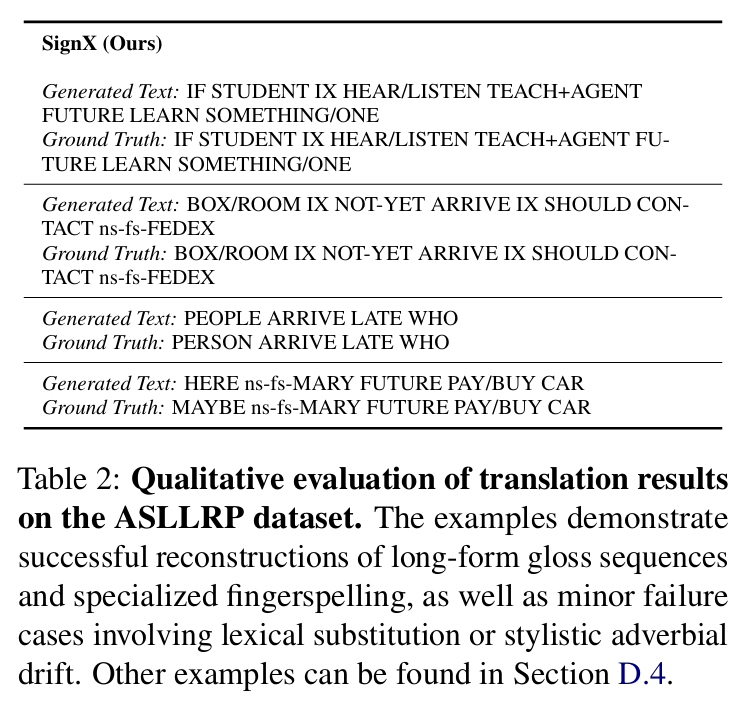
      <figcaption class="signx-carousel-caption">Table 2. Qualitative evaluation on ASLLRP.</figcaption>
    </figure>
    <figure class="signx-carousel-slide">
      <button class="signx-zoom" type="button" aria-label="Zoom image"><i class="fa fa-search-plus"></i></button>
      
      <figcaption class="signx-carousel-caption">Table 7. Cross-language qualitative evaluation.</figcaption>
    </figure>
  

  <button class="signx-carousel-arrow signx-carousel-right" type="button" aria-label="Scroll right"><i class="fa fa-chevron-right"></i></button>

### Component Ablation+Modality Importance+Modality Removal Evaluation

  <button class="signx-carousel-arrow signx-carousel-left" type="button" aria-label="Scroll left"><i class="fa fa-chevron-left"></i></button>
  

    <figure class="signx-carousel-slide">
      <button class="signx-zoom" type="button" aria-label="Zoom image"><i class="fa fa-search-plus"></i></button>
      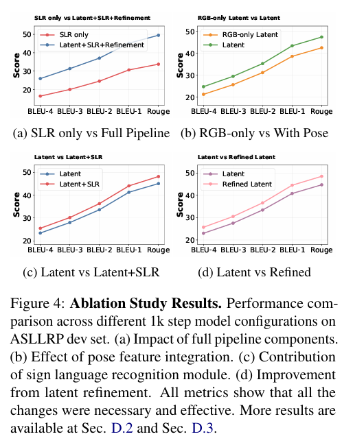
      <figcaption class="signx-carousel-caption">Figure 4. Ablation study results.</figcaption>
    </figure>
    <figure class="signx-carousel-slide">
      <button class="signx-zoom" type="button" aria-label="Zoom image"><i class="fa fa-search-plus"></i></button>
      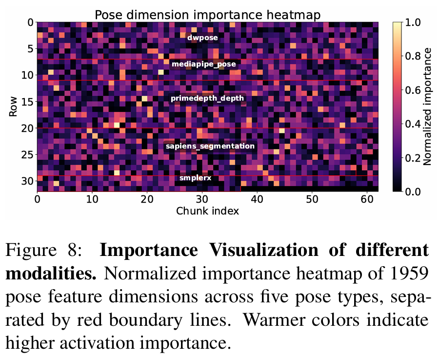
      <figcaption class="signx-carousel-caption">Figure 8. Modality importance heatmap.</figcaption>
    </figure>
    <figure class="signx-carousel-slide">
      <button class="signx-zoom" type="button" aria-label="Zoom image"><i class="fa fa-search-plus"></i></button>
      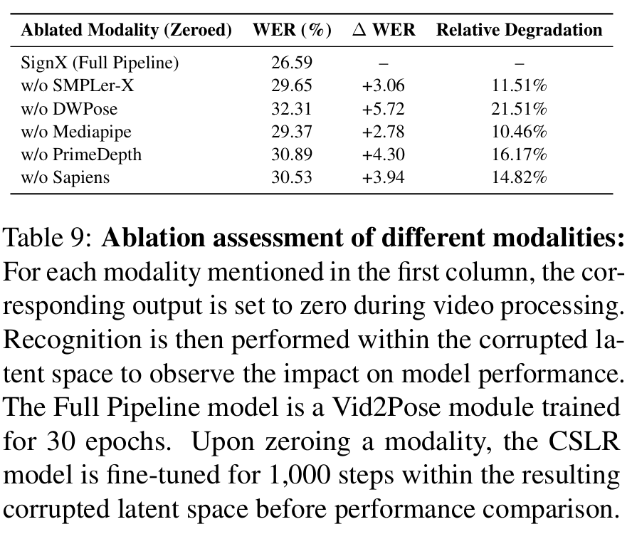
      <figcaption class="signx-carousel-caption">Table 9. Modality ablation assessment.</figcaption>
    </figure>
  

  <button class="signx-carousel-arrow signx-carousel-right" type="button" aria-label="Scroll right"><i class="fa fa-chevron-right"></i></button>

### Latent Space Optimization Efficiency+Hyperparameter Impact Evaluation

  <button class="signx-carousel-arrow signx-carousel-left" type="button" aria-label="Scroll left"><i class="fa fa-chevron-left"></i></button>
  

    <figure class="signx-carousel-slide">
      <button class="signx-zoom" type="button" aria-label="Zoom image"><i class="fa fa-search-plus"></i></button>
      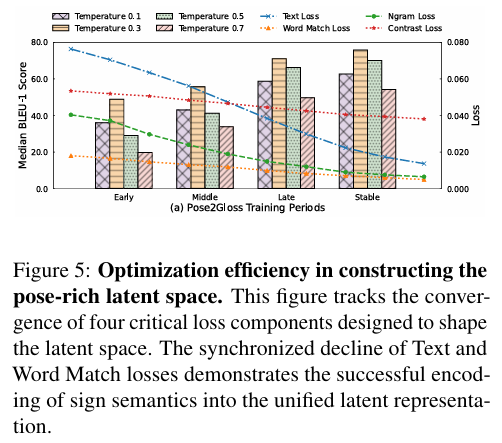
      <figcaption class="signx-carousel-caption">Figure 5. Optimization efficiency in constructing the latent space.</figcaption>
    </figure>
    <figure class="signx-carousel-slide">
      <button class="signx-zoom" type="button" aria-label="Zoom image"><i class="fa fa-search-plus"></i></button>
      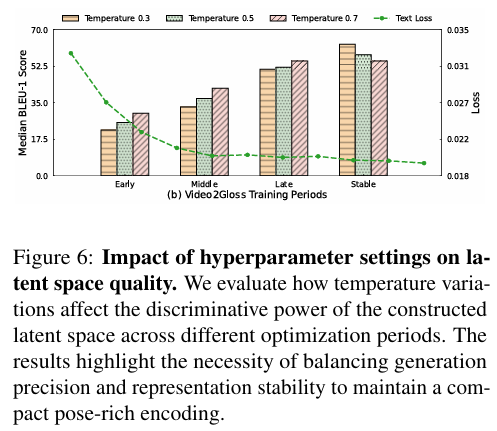
      <figcaption class="signx-carousel-caption">Figure 6. Hyperparameter impact on latent space quality.</figcaption>
    </figure>
  

  <button class="signx-carousel-arrow signx-carousel-right" type="button" aria-label="Scroll right"><i class="fa fa-chevron-right"></i></button>

### Inference Efficiency Evaluation

  <button class="signx-carousel-arrow signx-carousel-left" type="button" aria-label="Scroll left"><i class="fa fa-chevron-left"></i></button>
  

    <figure class="signx-carousel-slide">
      <button class="signx-zoom" type="button" aria-label="Zoom image"><i class="fa fa-search-plus"></i></button>
      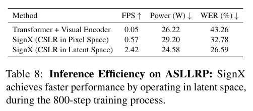
      <figcaption class="signx-carousel-caption">Table 8. Inference efficiency on ASLLRP.</figcaption>
    </figure>
  

  <button class="signx-carousel-arrow signx-carousel-right" type="button" aria-label="Scroll right"><i class="fa fa-chevron-right"></i></button>

### Attention Alignment+Tail-Feature Analysis+Interpretability Evaluation

  <button class="signx-carousel-arrow signx-carousel-left" type="button" aria-label="Scroll left"><i class="fa fa-chevron-left"></i></button>
  

    <figure class="signx-carousel-slide">
      <button class="signx-zoom" type="button" aria-label="Zoom image"><i class="fa fa-search-plus"></i></button>
      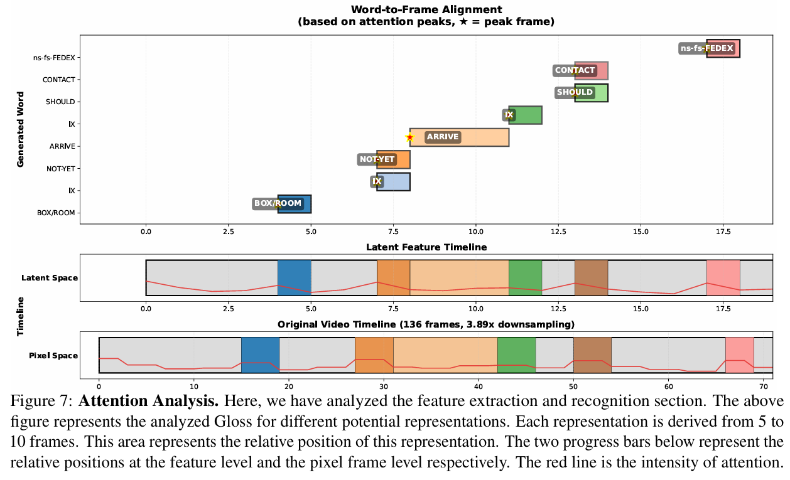
      <figcaption class="signx-carousel-caption">Figure 7. Attention analysis.</figcaption>
    </figure>
    <figure class="signx-carousel-slide">
      <button class="signx-zoom" type="button" aria-label="Zoom image"><i class="fa fa-search-plus"></i></button>
      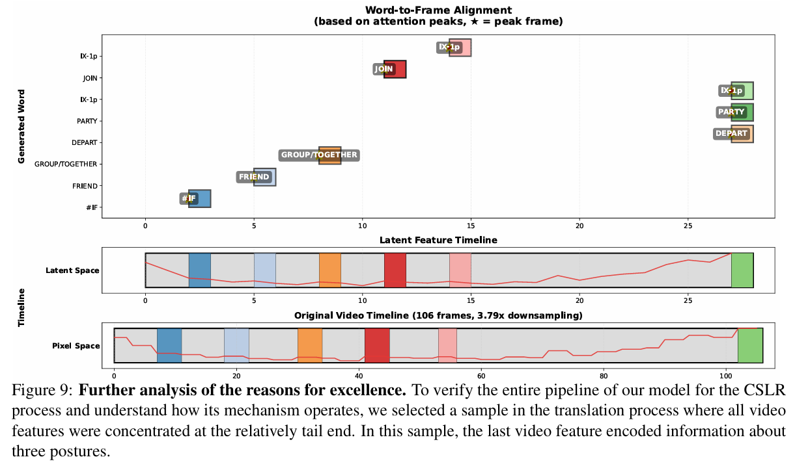
      <figcaption class="signx-carousel-caption">Figure 9. Tail-end feature analysis.</figcaption>
    </figure>
  

  <button class="signx-carousel-arrow signx-carousel-right" type="button" aria-label="Scroll right"><i class="fa fa-chevron-right"></i></button>

